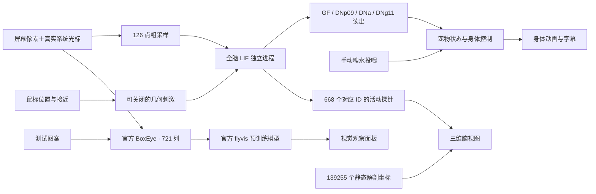

# 当前进度与验证

更新：2026-09-21。本文与根目录 README 是当前实现入口；编号方案/专题文档保留其阶段记录。本轮完成简单近场的持续目标、探索访问记录与个体摄入学习；30 项核心测试及桌面集成检查通过。

## 当前交付状态

最新自然观察（9 月 21 日 23:19–23:49）：新版完整运行约 1791 模拟秒，无手动暂停或故障。与旧版同样约 304 秒的前段比较，最常停留两格占比 90.2% → 21.4%，稳定停留/梳理阶段转速基本归零。正式个体在约 17 分 34 秒后吃完存档糖水并触发 1 次个体价值更新。不过 336 个完整检查目的中 295 个因失去线索结束，中位数仅 1.82 秒，目标稳定性仍不足。没有据此宣称稳定偏好/宠物感已解决。见 [自然观察对比报告](../output/behavior-analysis/2026-09-21T15-19-52-913Z-bf0660be/comparison.md)。

最新 C/D 交付：[35](35-purpose-and-learning-implementation.md) 已修复静止转向，加入基于实际截图区域的持续检查/接近、衰减访问记忆及摄入事件驱动的作者 DPR 价值更新。独立全脑个体约 7 秒模拟时间通过像素接近糖水，真实 Windows 糖水窗口约 10.32 秒后实现接触与学习；配对脑/学习重启验证通过。8 次简单线索配对后，奖励线索相对价值提高且换位置仍保持差异；一次完整试验约 4–6 秒 CPU 墙钟，未覆盖正式个体。此为简单近场闭环，不是食物语义或复杂页面可靠觅食。以下阶段报告保留当时口径。

最新行为诊断：[34](34-trajectory-and-petness-review.md) 已复算正式轨迹并核对当前代码。有效 304 秒里约 90% 时间局限于相邻两格；停留/梳理时仍持续转向；前方价值执行片段中位数仅 0.41 秒。A/B 的动作稳定与接触机制已实现，但不能据此称为有目标的探索；C 仍缺目标保持/接近，D 的个体奖励学习未接通。本轮只分析，未更改行为或训练。

最新性能优化：[33](33-performance-optimization.md) 已完成，保留全脑/视觉模型规模和权重。固定权重 CSR 推理、按受体采样、减少重复截图/中间态、隐藏窗口停绘及重复原生窗口操作消除。独立桌面流程的 20 秒进程树采样：CPU 19.92% → 5.42%（下降约 72.8%），工作集合计 1998.5 → 1743.9 MiB，视觉约 10.8 → 14.6 帧/秒；不是整卡 GPU 或任意负载保证。25 项 Node、空间视觉、数值等价与桌面验证通过。正式个体保留原 ID、脑状态和用户先前的暂停状态。

最新观测功能：[32](32-behavior-monitor.md) 增加 `127.0.0.1:8789` 本机测试端口与 30 分钟观察按钮。10 Hz 保存轨迹，按模拟步累计实际摄入；到时输出中文报告、轨迹 SVG、JSON 指标与原始 JSONL。不改变脑或行为，不输出未经校准的宠物感总分。独立桌面检查记录 444 个样本、0.523 秒实际摄入；采样同步工作平均 0.057 ms，最大 0.152 ms（不含异步磁盘刷新和期末报告）。同期 30.414 秒推进脑模拟 30.250 秒，最大队列 117 ms。正式 30 分钟自然观察结论须以该轮完成报告为准，不能用自动测试代替。

首轮正式观察已于 2026-09-21 11:21:47（北京时间）完成：17820 样本，墙钟 30 分钟中有约 24.86 分钟手动暂停，有效身体活动约 5.07 分钟；视觉/周边转向实际采用占启用视觉辅助的行走时长约 14.2%。无糖水，鼠标有效机会仅 1 次，不能据此给出总体宠物感或投喂能力结论。详见 [观察解读](32-behavior-monitor.md)。

最新运行稳定性修正：[31](31-recoverable-backpressure.md) 已把短暂积压从永久故障改为自动追赶，新增队列和追赶计数显示。20 项核心测试与桌面验证通过；真实进程失败仍保留暂停保护。

最新可视输入修正：[30](30-visual-input-visibility.md) 取消默认整窗灰色遮罩，新增可选“忽略观察室”及同帧采集画面／复眼对照。20 项核心测试、遮罩复现及桌面验证通过。显示改善不等于增加了 721 列模型的空间分辨率或色觉。

最新周边升级：[29](29-peripheral-vision.md) 已接入当前屏幕内半径 480 DIP 八方向变化感知与短暂转身查看，保留原前方精细视觉。20 项核心测试、周边传感及桌面 smoke 通过；约 31.25 秒推进 30.95 秒脑模拟。此为工程周边采样，不是生物 360°复眼或在线学习。

最新增量：[空间视觉升级](27-spatial-vision-upgrade.md) 已交付 T4/T5 空间响应、自运动提示与独立“视觉转向”开关。冻结学习价值可经工程接口辅助行走；不是全脑视觉神经通路重建，也未实现在线学习。17 项核心测试、空间模型实测与桌面 smoke 通过；30.48 秒持续运行推进 30.45 秒模拟，最大待算时间 138 ms。下文旧阶段对“官方视觉只观察”的描述按此更新理解。

| 功能 | 状态 | 实现范围 |
|---|---|---|
| 全脑运行 | 已接入 | 138639 神经元 / 15091983 连接对，2 ms；是完整配套连接图的简化动力学，不是完整动物生理复制 |
| 身体动作 | 已稳定协调 | 移除正弦转向，保存探索随机状态；动作保持和迟滞；普通逃逸需近期鼠标威胁＋GF，保留手动 GF 干预 |
| 进食 | 已实现桌面糖水 | 点击放置，落地接触 20 DIP 内且速度低于 2 才摄入；6 秒储量、0.12 饥饿/秒，支持取消、替换、移除与恢复 |
| 全脑感觉输入 | 已接入粗采样 | 左右共 126 点，映射到 8753 个感受器；鼠标几何刺激可独立开关 |
| 官方 flyvis | 已验证并接入观察 | 官方权重，45669 单元 / 1513231 连接 / 721 列；灰度运动视觉，未训练、未微调、不驱动身体 |
| 鼠标可见性 | 已修复 | 两条视觉输入都在原始像素中合成系统光标；官方预览附位置标注 |
| 官方取景方向 | 已修复 | 随身体朝向，上远下近；中心位于前方 80 DIP，宽 320 DIP，屏外留灰；属于工程取景适配 |
| 测试输入 | 已区分 | 右移亮块、左移暗圆、页面上滚；明确为测试图案 |
| 三维脑图 | 已实现 | 139255 个静态解剖代表坐标 + 668 个活动探针，旋转、缩放、复位、图层开关 |
| 可观察性 | 已实现 | 字幕、状态、事件、神经读出；两个主面板可放大，Esc 返回 |
| 个体连续性 | 已实现 | 全脑配对检查点、个体 ID、内部状态、位置和进食进度；离线时间暂停 |
| 区域检查 / 近场接近 / 摄入学习 | 已接通首版 | 截图候选经 Tm3 和个体价值评分；实际摄入更新 KC→MBON，记忆与个体配对保存 |
| 色觉 / 食物语义 / 复杂页面可靠觅食 | 未实现 | 简单线索闭环不能替代泛化能力验证 |

初始 668 神经元模型保留为测试参照，不再控制正式桌宠。全脑图、静态背景点数和官方视觉模型单元数不能混加为一个“大脑规模”。

## 当前运行链路

官方视觉通过局部学习回路和工程目标影响身体，未重建到全脑的神经级连接。糖水接触与摄入是产品世界机制，摄入事件可以调制已配对线索的作者学习回路，不代表完整味觉/奖励通路复现。几何鼠标通道独立于像素视觉。

## 代码入口

| 位置 | 职责 |
|---|---|
| [app.cjs](../src/main/app.cjs) | Electron 生命周期、窗口、进程协调、IPC、保存 |
| [pet.mjs](../src/core/pet.mjs)、[motion.mjs](../src/core/motion.mjs) | 统一状态、手动进食、行为读出、运动连续性 |
| [brain/worker.py](../src/brain/worker.py) | 全脑动态、粗采样与全脑检查点 |
| [vision/worker.py](../src/vision/worker.py)、[official_model.py](../src/vision/official_model.py) | 官方模型加载、输入与观察输出；含仅涉及 Windows HDF5 的兼容修复 |
| [cursor_capture.py](../src/vision/cursor_capture.py)、[test_patterns.py](../src/vision/test_patterns.py) | 系统光标合成、不同测试图案 |
| [inspector.js](../src/renderer/inspector.js)、[brain-view.js](../src/renderer/brain-view.js) | 观察室、三维解剖背景与活动层 |
| [scripts](../scripts) | 安装、环境路径、数据准备、启动与性能实验 |

## 已有验证证据

最近桌面报告时间：2026-09-19 13:49:13 UTC（北京时间 21:49:13）。本轮重新执行桌面 smoke 和取景几何检查；Node、原生光标和官方标准刺激结果沿用此前保存证据。

- [Node 测试输出](../output/verification/core-tests.txt)：10 项通过，覆盖神经因果、坐标负零、状态恢复、暂停、投喂、动作连续性，以及全脑子进程故障暂停。
- [取景几何检查](../output/verification/view-geometry-tests.json)：15 组方向/缩放组合通过，另验证负坐标屏幕、图像与标记对齐、屏幕边缘留灰不漂移。见 [修正说明](15-view-orientation-fix.md)。
- [原生视觉输入检查](../output/verification/visual-input-tests.json)：实际系统光标合成改变像素；屏外不污染；图案不同且运动方向正确。
- [桌面集成报告](../output/verification/desktop-smoke.json)：`passed: true`；实际检查投喂、光标进入官方复眼、输入切换、三维旋转/缩放/图层、面板放大、全脑干预和跨进程存档恢复。持续约 30.73 秒推进 30.65 秒脑模拟，最大待计算时间 127 ms。
- [官方模型刺激验证](../output/flyvis/official-model-validation.json)：8 个标准移动边缘条件，验证部分 T4/T5 方向和明暗偏好；不是论文全套实验复现。
- [全脑独立性能报告](../output/whole-brain/benchmark.json)、[2 ms 持续测试](../output/whole-brain/paced-2ms.json)：独立引擎在本机可实时运行。其 CPU/RSS 不包含完整桌宠渲染、采集与官方视觉观察，不能当作整机常驻开销。

`output/verification` 是最近一次验证输出，会被后续 smoke 覆盖。早期专题中引用的同名文件，不再保证保留当时的截图或数值；阶段结论保留在对应文档正文。单实例测试结果也不保证多个实例同时运行时具有相同性能。

## 连续性与来源

正式恢复以 `.runtime/pet/full-brain.npz` 中配对保存的个体和神经动态为准，JSON 只是摘要。全脑升级时保留了 ID 和经历，但全脑动态曾首次初始化；不能称为把 668 个神经元电位无损迁移到全部神经元。

当前三维背景来自 FlyWire 原始代表坐标，渲染函数复用 DesktopFly，交互复用 three.js OrbitControls。官方 flyvis 用作者实现与原始权重。身体、窗口、状态、感觉接口和必要产品控制由 FlyPet 维护。

## 尚未完成与后续边界

Life Layer A/B 已交付，见 [26](26-life-layer-first-implementation.md)。C/D 首个近场闭环现已实现，见 [35](35-purpose-and-learning-implementation.md)；复杂画面泛化、长期行为体验与更多互动仍不在已验证范围内。下面的独立实验记录描述各自开展时的状态。

[实现方案与训练预算](25-life-layer-implementation.md) 继续约束后续 C/D：默认单次离线训练 10 分钟、同轮累计 30 分钟上限，停止后不自动续跑。本轮 A/B 未训练。

学习专项已完成 [文献与代码调研](16-learning-literature-and-options.md) 及 [独立模型 GPU 试验](17-learning-pilot.md)：受控奖励关联、保存记忆后的趋近和位置交换测试有效；直接自由探索的选择性及完整反转尚未达标。正式个体尚未接入该学习回路，下述产品边界不变。

后续 [页面封面视觉实验](18-visual-association-pilot.md) 已用用户截图、官方 flyvis 和工程视觉编码，验证两张图片的奖励关联及冻结学习对照。它是独立的评分演示，尚未接通桌面身体，不代表美食类别识别。

2026-09-20 已完成 [食物类别小试验](21-food-category-training.md)：130 张食物／非食物图片，按截图来源划分，用 GPU 训练四组记忆，验证集选择 5 轮；34 张测试图 AUC 0.646。效果有限，未接入正式个体；没有继续扩大模型或追分调参。

- 视觉与动作已有工程目标接口，但不等同于全脑神经连接层面的完整视觉通路。
- 美食视频不是食物标注；不存在识别视频内容并自主进食的已验证机制。
- 正式个体已能在实际摄入后更新可配对线索的记忆；完整色觉、完整腹神经索、声音、昼夜睡眠或真正跨屏自由漫游尚未实现。
- 现有视觉、内在动机、运动读出和手动进食包含明确简化；不能把所有动作描述为未经人工假设的涌现行为。

继续开发时遵循：先解决具体体验问题，优先现成模型；只有明确需要时才做小范围连接/调参，不展开新生理模型、大规模训练或论文式实验。这是后续范围说明，不是本次维护新增的开发任务。

## Life Layer A/B 最新验证

2026-09-20 桌面报告 passed=true；125% 与 150% 双屏放置、糖水实际截图像素、Esc 取消、接触摄入、神经干预及存档验证通过。30.46 秒墙钟推进 30.40 秒脑模拟，最大待算时间 127 ms。15 项核心测试全部通过。见 [完整实施记录](26-life-layer-first-implementation.md)。上文旧时间和性能数据保留历史口径，以本节最新验证为准。C/D 尚未接入。
