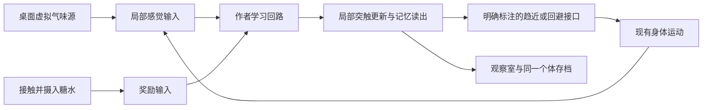

# 学习与互动：文献、开源实现及路线选择

调研日期：2026-09-19。范围：理论分析、作者论文和 GitHub 实现核查。**未训练、未安装新模型、未修改正式程序或个体存档。** 本文提出候选和下一次实验范围，不把上游报告当成本机复现结果。

## 结论与推荐

有比“微调整个苍蝇大脑”更合适的办法：采用已有论文中的小型、在线可塑的蘑菇体模型，让经历改变线索的吸引或回避倾向；保留已有身体与视觉前端。当前优先候选是 **Gkanias 等人的 IncentiveCircuit**，先复现作者的气味关联及二维行为实验，再决定接入。

这条路线同时服务两个目标：用户能通过投喂改变它今后的行为；观察室能展示实际变化的突触和记忆读出。它仍然是有明确假设的混合模型，不等于原全脑已自然产生学习。首版学习对象建议是两种虚拟气味线索，视觉关联随后单独验证。不要把气味输入偷偷换成食物类别标签，再称作它从视频里认出了食物。

没有发现已核实、可直接接到本项目、同时满足“成熟高 star、作者验证、全脑在线学习、任意桌面视觉、持续自主觅食”的现成方案。高 star 的身体和视觉库值得保留；学习模块应允许论文作者低 star 仓库作为专项候选。

## 1. 当前缺少什么

本机代码复核：`src/brain/worker.py` 传播固定连接权重，没有经验相关的权重更新；`src/vision/official_model.py` 使用 eval 和冻结参数；`src/core/pet.mjs` 的进食和部分动机输入由产品规则实现。官方 flyvis 目前独立观察，未参与身体决策。

因此有三个需要分别解决的环节：

| 环节 | 用户能感受到的变化 | 是否必须训练 |
|---|---|---|
| 感觉—行动闭环 | 附近有东西时会转向、接近、停下或逃开 | 不一定；已有反射／控制器即可 |
| 经验学习 | 同样线索在被投喂前后引起不同选择 | 需要学习机制，但可局部在线更新 |
| 持续个体 | 偏好跨会话保留，新的经历能改变旧偏好 | 保存学习权重及必要动态，不只是保存 ID |

固定权重的递归网络也可能维持短时状态，不能把“没有权重更新”泛化成“所有固定网络都不可能有记忆”。但当前 FlyPet 没有实现或验证奖励关联学习，不能把不断变化的放电和饥饿解释为已经学会。[P3]

## 2. 哪些生物学结论可以支撑我们的设计

### 2.1 可以优先做“线索—结果”的关联

果蝇的蘑菇体包含编码线索的 Kenyon cells（KC）、输出神经元（MBON）和调节可塑性的多巴胺神经元（DAN）。多巴胺调节 KC→MBON 的作用，但不同分区、时序及输出通路并不等价。“所有奖励都加强连接、所有惩罚都削弱连接”不是可靠的通用实现。[P3、P6]

Bennett 等的模型说明，奖励预测误差可以通过蘑菇体回路计算，而不必把整脑作为大型优化对象；这是一个有明确假设的计算模型，不意味着果蝇所有学习只遵循一条误差规则。[P2]

### 2.2 视觉关联与空间记忆要分开

Vogt 等的实验支持视觉和嗅觉关联记忆共享部分蘑菇体回路；后续研究描述了视觉输入到蘑菇体的通路。这支持研究视觉线索学习，但没有提供“灰度桌面截图直接变成可靠 KC 编码”的现成接口，也没有证明模型能理解菜肴。[P4、P5]

Ofstad 等的热迷宫实验中，椭球体部分神经元对视觉地点学习必要，而蘑菇体干预没有造成同样结果。这是特定任务中的实验结论。对本项目的含义：第一版先学线索的价值，不把屏幕坐标记忆、导航和线索偏好混成一个功能。[P7]

### 2.3 运动视觉前端不等于食物识别器

flyvis 原模型针对光流任务优化，并与视觉神经响应比较；它适合作为运动感觉前端。当前展示的八组 T4/T5 均值尤其不能充当任意图案或食物的身份编码。后续视觉关联必须保留足够空间信息，验证同一线索在位置／尺度变化下能否被区分；原模型没有给出这种泛化保证。[P8]

## 3. 候选方案比较

| 路线 | 已有依据与实现 | 对我们的价值 | 当前取舍 |
|---|---|---|---|
| **IncentiveCircuit 小型在线回路** | eLife 2022，作者 Python／NumPy 代码，二维气味环境 | 关联、更新和趋近／回避已在同一研究框架中出现；便于观察权重 | **首选复现**；嗅觉任务先行 |
| Bennett 奖励预测误差回路 | Nature Communications 2021，作者 MATLAB 代码 | 简洁的价值学习解释和对照模型 | 理论／对照参考，避免同时移植第二套 |
| Jiang–Litwin-Kumar 可塑 RNN | PLOS Computational Biology 2021，作者 PyTorch 代码 | 先优化学习信号，再在线学新关联；有更丰富任务 | 后备；多一个离线优化阶段，工程入口较简陋 |
| 在现有 LIF 全脑内增加局部可塑性 | 社区 fly-api 等实验 | 学习发生在连接组对应边上，符合全脑观察目标 | 暂不作为最快路径；输入编码、稳定性和输出解释尚需解决 |
| 现成身体控制器 + 高层 RL | NeuroMechFly v2／flygym、flybody | 已有可训练的运动／导航任务 | 适合身体物理仿真需求，当前引入成本高于局部学习 |
| FlyGM 全脑图控制器 | 2026 预印本，连接组图上的可训练控制器 | 展示另一类利用连接组的训练方法 | 暂不选：不是当前 LIF 的小补丁，官网代码仍标 Coming soon |
| 普通小型 RL／价值表 | 通用工程实现 | 最容易控制效果和成本 | 可作实验对照，不把它包装成果蝇生理学习 |

### 3.1 首选：IncentiveCircuit

论文用 6 个 DAN 和 6 个 MBON 构成核心回路，并接收 KC 输入；提出在线可塑性规则，讨论学习、记忆更新和不同时间尺度。作者还给出两种气味环境中的行为模拟。[P1]

代码核查：`circuit.py` 继承 `MBModel`；`models_base.py` 提供 `update_values`、`update_weights`，并保留响应与权重历史；`arena.py` 将环境输入与运动组成循环。已有示例能减少我们自行发明学习规则和行为映射的工作。[G1]

需要适配的是持续运行接口：原代码按有限 trial 预分配历史，不宜不加修改地永久追加；要保留当前权重、状态、随机状态，同时限制可视化历史。原论文不同实验使用不同时间步约定，不能把一轮更新机械地放进我们 2 ms 全脑循环，否则学习速度会被任意放大。它的“12 个核心单元”也不能与 138639 个全脑神经元直接相加后称为更完整的生物脑。[G1]

论文的简化模型不是从当前 FlyWire 个体切出的精确子图。先做独立复现；正式接入时明确显示学习回路来源及影响身体的接口，不在原三维脑图中伪装成对应真实 ID 的学习活动。

### 3.2 后备：先优化学习机制，再在线学习

Jiang–Litwin-Kumar 模型区分两个过程：离线优化产生学习信号的网络，使用时固定这些连接，仅靠多巴胺门控可塑性学习新关联。论文涉及条件化、消退、二阶关联等任务。[P3]

作者仓库包含 `definemodel.py`、`gentrials.py`、`runmodel.py` 和 `train.py`；后者默认 5000 epochs，一阶配置为 2000，batch 为 30，使用 RMSprop。`runmodel.py` 明确更新可塑权重及时间痕迹。检查到的仓库树未含预训练权重，不能承诺下载即可获得全部论文能力。[G3]

此路线比全脑训练小得多，但对于首版糖水互动，IncentiveCircuit 更直接。若首选无法满足所需的线索泛化或关联更新，再考虑此路线。

## 4. GitHub 演示的能力与代价

### fly-api：接近目标，但不是原全脑原样学习

项目作者报告嗅觉条件学习及趋近奖励气味，学习实验使用 8991 神经元的嗅觉—蘑菇体子网，做了四类连接删改；奖励直接输入 DAN。其报告还说明行为读出使用 KC→MBON 增益修正、分区机制被简化。导航端的转向和到达规则是工程接口。[G4]

`learning_driver_mb.py` 与报告相符：按 episode 中 KC 和 PAM 活动更新部分连接，且每次 episode 重设膜电位／突触状态；还存在硬编码的作者本机注释数据路径。因此它适合参考数据分组、可塑边选择和最小学习实验，不能原样声称是我们持续全脑个体的学习插件。上游成功率或抑制幅度尚未本机复现。

### DOOMFLY：有可塑性不等于学会游戏

作者 README 明确说明当前 v6 没有通过视觉、条件学习及生存验证；神经元到游戏按钮的对应是工程设计。这个反例最有价值的地方，是公开了失败结果：更大的连接图、持续刺激多巴胺、权重发生变化，都不足以证明任务能力提升。[G5]

### fly-brain：有持久化，但规则不能直接当成生理事实

所查 `dopamine_learning.py` 自称第一阶段为手动权重调制，自动 STDP 为后续方向；代码对活跃 KC 到全部选中 MBON 采用统一乘数，奖励默认加强、惩罚默认削弱。可以参考持久化接口，但缺少分区与通路解释，不能仅凭注释推断“奖励后必然趋近”。[G6]

### 身体仿真与热门演示

NeuroMechFly v2 提供感觉运动环境及多模态导航训练研究；flybody 提供精细身体和运动 RL 任务。它们解决的主要问题是具身控制，不是把糖水奖励自动变成个体记忆。[P9、G7、G8]

Eon 官方技术说明同样区分已有身体控制器、人工感觉／动作接口及缺失的学习机制；视频里趋近食物有虚拟味觉线索。对我们的启发是补上可感知、可行动的环境，而不是从视频标题推断通用学习已经完成。[S1]

## 5. stars、维护和复用条件

以下数字来自 2026-09-19 本次 GitHub API 查询；会变化。提交 SHA 和 pushed_at 见 [查询记录](../research/learning/repositories.json)。仓库受欢迎程度与学术证据分别评估。

| 仓库 | Stars | API 识别许可 | 本次判断 |
|---|---:|---|---|
| InsectRobotics/IncentiveCircuit | 1 | GPL-3.0；代码头 GPLv3+ | 低 star 例外候选：论文作者实现，任务匹配；最后推送 2023 年，需检查新环境兼容 |
| BrainsOnBoard/paper_RPEs_in_drosophila_mb | 6 | GPL-3.0 | 作者 MATLAB 研究代码，2021 年后未更新 |
| alitwinkumar/jiang_litwin-kumar_mb_rnn | 4 | GPL-3.0 | 作者 PyTorch 研究代码，2021 年后未更新 |
| dtch1997/fly-api | 7 | MIT | 近期集成实验；适合参考，不直接替换全脑 |
| nftechie/doomfly | 364 | MIT | 满足 star 偏好，但明确存在学习失败结果 |
| lixiang1076/fly-brain | 23 | MIT | 学习规则仍较粗，非首选 |
| NeLy-EPFL/flygym | 360 | Apache-2.0 | 已有生态，当前不引入完整物理环境 |
| TuragaLab/flybody | 921 | Apache-2.0 | 身体和运动资产候选，非关联学习核心 |

Shiu 与 flyvis 本次 API 刷新遇到限流，未把旧 star 当作新查询结果。首选学习候选均未达到 100 stars；保留它们的理由是作者代码与明确实验任务，而不是把低 star 隐去。研究原型与正式分发分开，若复制 GPL 代码进入交付产品，应在选定集成方式时处理相应许可要求；目前仅资料查阅。依赖及数据许可另计。

## 6. 建议的最小产品路径

### 第一步：先用现成任务证明“这次经历会改变下一次选择”

按 IncentiveCircuit 的作者协议复现 A/B 气味关联和行为示例，不先改成任意桌面图像。候选符合预期后，再把屏幕中的两种虚拟气味源和糖水接入。

用户可以把糖水放在某种气味源旁；苍蝇接触糖水获得奖励，之后更倾向于相应线索。奖励应来自接触／摄入事件，而不是检测到用户按了按钮就远距离获得。糖水本身不应被描述成远距离气味来源；如使用果味提示，应明确是虚拟环境添加的气味场。

这是建议的试验结构，不是已接通的功能，也没有宣称两个脑模型天然兼容。与现有全脑共同控制时，应明确学习输出如何影响当前行为；不会为了保留“全脑控制”的宣传而叠加一条未经验证的神经接口。

### 第二步：把学习扩展到屏幕视觉线索

优先尝试两种可区分的灰度纹理，而不是任意美食内容。输入必须实际来自被看到的图像；奖励只能训练线索价值，不能让程序直接把“当前这个物体是奖励目标”的标签送进感觉端。视觉到学习回路的编码属于新增工程适配，需单独验证；Vogt 的实验并不直接验证我们的灰度纹理接口。

若仅两种纹理也难稳定区分，先解决编码，不加大整脑训练规模。学会偏好一种线索以后，才有理由尝试更复杂视觉。

### 与 B 站视频互动的边界

点击在视频附近放置虚拟食物，可以先获得明确互动：它通过虚拟环境感觉找到食物并产生经验。此时不能称为“认出视频中的食物”。自动识别视频美食需要额外的视觉语义能力；本次核查的 flyvis 和学习回路未提供这一能力。暂不额外引入通用图像分类器，以免偏离用户要观察苍蝇模型的目标。

## 7. 训练成本：修正先前估计

之前对“3–7 天接入、几分钟到几十分钟训练”的描述只是粗略工程猜测，不能作为本项目已验证周期。本次依据支持以下更可靠的区分：

| 项目 | 可依据源码／论文判断 | 尚需实际测量 |
|---|---|---|
| IncentiveCircuit | 小矩阵的前向更新和局部可塑性，无需整脑反向传播；CPU 是合理起点 | 当前 Python 兼容、单轮墙钟、长时间运行与动作接口 |
| Jiang–Litwin-Kumar | 小型网络但需离线优化；线上局部学习与离线优化分开 | 收敛轮数、现有 PyTorch 兼容及 CPU/GPU 时间 |
| 全脑局部可塑性 | 更新的边可以少，但整脑活动、编码和读出仍需正确 | 合适分区、稳定性、学习效果、运行开销 |
| 全身体 RL／FlyGM | 还包含模拟环境与重复轨迹优化 | 8 GB 显存可用配置、样本量和收敛；目前没有本机保证 |

对首选而言，8 GB 显存／32 GB 内存不是理论上的主要门槛；也没有必要为了小回路先安装 CUDA 或训练集。少数配对、论文中的模拟秒数、电脑运行墙钟、程序开发天数是四个不同量。第一轮复现只需测出启动成本、协议运行时间和输出是否正确，再给出接入估算。

## 8. 下一次实验的完成标准

只做一条首选路线，不并行搭建所有候选：

1. 原始协议下，奖励配对前后对 A/B 的反应发生有方向的差异；未配对或冻结可塑性的对照不产生同等变化。
2. 交换线索位置后偏好跟随线索；这里检验的是线索价值，不要求已经形成地点记忆。
3. 学习权重保存／恢复后结果保留，改变配对关系时按模型能力更新。
4. 用作者二维行为示例确认记忆能改变选择；仅权重变化不算完成。

先检验作者已有功能，再做产品接入。若原始协议失败，先修环境或兼容问题；若模型通过而桌面互动失败，检查感觉和动作接口，不直接修改作者学习规律。原始结果与适配结果分别记录即可，不扩展成全套论文复现。

## 9. 来源与核查范围

### 论文与作者资料

- **P1** Gkanias et al., 2022, *An incentive circuit for memory dynamics in the mushroom body of Drosophila melanogaster*, eLife 11:e75611. [全文](https://elifesciences.org/articles/75611)。核查模型、学习规则、行为与模拟时间约定。
- **P2** Bennett et al., 2021, *Learning with reinforcement prediction errors in a model of the Drosophila mushroom body*, Nature Communications 12:2569. [论文](https://www.nature.com/articles/s41467-021-22592-4)。核查模型主张和代码来源。
- **P3** Jiang & Litwin-Kumar, 2021, *Models of heterogeneous dopamine signaling in an insect learning and memory center*, PLOS Computational Biology 17:e1009205. [全文](https://journals.plos.org/ploscompbiol/article?id=10.1371/journal.pcbi.1009205)。核查元学习与在线可塑性分工。
- **P4** Vogt et al., 2014, *Shared mushroom body circuits underlie visual and olfactory memories in Drosophila*, eLife 3:e02395. [论文](https://elifesciences.org/articles/02395)。核查视觉与嗅觉关联实验结论。
- **P5** Vogt et al., 2016, *Direct neural pathways convey distinct visual information to Drosophila mushroom bodies*, eLife 5:e14009. [论文](https://elifesciences.org/articles/14009)。核查摘要及视觉输入通路主题。
- **P6** Aso & Rubin, 2016, *Dopaminergic neurons write and update memories with cell-type-specific rules*, eLife 5:e16135. [全文](https://pmc.ncbi.nlm.nih.gov/articles/PMC4987137/)。核查细胞类型及时序相关记忆更新结论。
- **P7** Ofstad et al., 2011, *Visual place learning in Drosophila melanogaster*, Nature 474:204–207. [作者论文](https://www.columbia.edu/cu/zukerlab/Publications_files/2011%20Nature%20Ofstad.pdf)。核查热迷宫、椭球体与蘑菇体干预区别。
- **P8** Lappalainen et al., 2024, *Connectome-constrained networks predict neural activity across the fly visual system*, Nature. [论文](https://www.nature.com/articles/s41586-024-07939-3)。核查光流任务和能力范围。
- **P9** Wang-Chen et al., 2024, *NeuroMechFly v2: simulating embodied sensorimotor control in adult Drosophila*, Nature Methods. [论文](https://www.nature.com/articles/s41592-024-02497-y)。核查多模态导航和代码／预训练资源说明，未复现实验。
- **P10** Jin et al., 2026, *Whole-Brain Connectomic Graph Model Enables Whole-Body Locomotion Control in Fruit Fly*, arXiv:2602.17997v1，预印本。 [论文](https://arxiv.org/html/2602.17997v1)、[项目页](https://lnsgroup.cc/research/FlyGM/)。核查图控制架构；访问时项目页代码标注 Coming soon。
- **S1** Eon, *How the Eon Team Produced a Virtual Embodied Fly*. [官方技术说明](https://eon.systems/updates/embodied-brain-emulation)。用于区分感觉、身体控制器和学习缺口，不当作同行评审的学习证明。

### GitHub 及具体代码

- **G1** [IncentiveCircuit](https://github.com/InsectRobotics/IncentiveCircuit)：[circuit.py](https://github.com/InsectRobotics/IncentiveCircuit/blob/1610c80072fe8bb59bd397e7a61f716393a509b9/src/incentive/circuit.py)、[models_base.py](https://github.com/InsectRobotics/IncentiveCircuit/blob/1610c80072fe8bb59bd397e7a61f716393a509b9/src/incentive/models_base.py)、[arena.py](https://github.com/InsectRobotics/IncentiveCircuit/blob/1610c80072fe8bb59bd397e7a61f716393a509b9/src/incentive/arena.py)。已读关键实现，未执行。
- **G2** [Bennett 作者仓库](https://github.com/BrainsOnBoard/paper_RPEs_in_drosophila_mb)：已读 README／文件布局，未逐行审查 MATLAB 或执行。
- **G3** [Jiang–Litwin-Kumar 作者仓库](https://github.com/alitwinkumar/jiang_litwin-kumar_mb_rnn)：已读 `train.py`、`runmodel.py`，检查完整仓库树，未执行训练。
- **G4** [fly-api 学习报告](https://github.com/dtch1997/fly-api/blob/main/experiments/learning/report.md)、[学习实现](https://github.com/dtch1997/fly-api/blob/main/experiments/learning/learning_driver_mb.py)、[导航报告](https://github.com/dtch1997/fly-api/blob/main/experiments/navigation/report.md)。代码与作者报告交叉核对，未独立确认数值结果。
- **G5** [DOOMFLY](https://github.com/nftechie/doomfly)：已读 README 的 v6 失败声明与接口说明，核查迭代报告入口；没有本机运行 Doom。
- **G6** [fly-brain 学习代码](https://github.com/lixiang1076/fly-brain/blob/main/dopamine_learning.py)：已读手动乘数更新与保存逻辑。
- **G7** [flygym](https://github.com/NeLy-EPFL/flygym)、**G8** [flybody](https://github.com/TuragaLab/flybody)：核查作者来源、用途、仓库元数据，未安装或训练。

资料目录：[research/learning](../research/learning)。本轮只保存少量元数据、仓库树和源码参考；未下载模型数据集。Clash 7897 的 TLS 请求失败后，GitHub 元数据通过 Python 直接连接取得；后续部分 API 请求限流，保留错误记录，其余源码通过网页阅读。本轮没有改变系统代理或关闭 TLS 证书校验。
